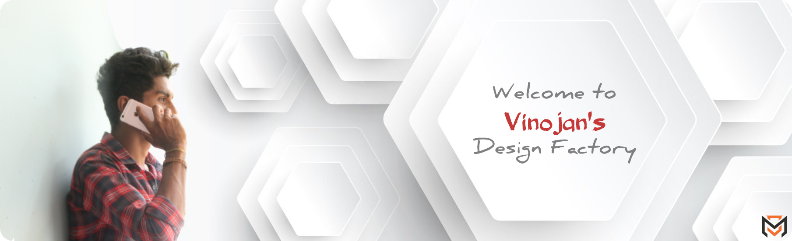

# Hello, Folks! 

<!-- ////////////////// START README FILE /////////////////// -->

<h1 align="center">I'm Vinojan Veerapathirathasan</h1>

 Never let anyone tell you that <b>"You can't"</b> Because can't is a word I eliminate from my vocabulary and replace it with <b>Strength</b>..!

<!-- Counter of profile viewers -->

 
 

<!--//////////// About my self ////////////////-->
🔅 Founder and CEO at [**DecHorizon Technologies**](https://dechorizon.com/)

🔅 Former Intern Software Engineer at [**Bluebay Labs**](https://blubaylabs.co/)

<!-- 🔅 Previous Projects 💼
- [Adventure Club Website](https://ac-uok.com/)
- [SEO for TOWNCHIC](https://townchic.co/)
- [Eventers-Event](https://eventersevents.com/)
- [BookBae](https://www.bookbae.store/) -->

🔅 Get into touch with [My Portfolio Site](https://vinojan.online) 👨‍💻

<!-- 🔅 Lets checkout my articles on the [Medium](https://medium.com/@iam_vinojan) 📝 -->

<!--////////////// Blog section ///////////// -->
## Blogs posts
✍️ Visit Medium - [@iam_vinojan](https://medium.com/@imvinojanv) 📝

<!-- //////// GitHub Stats /////////////-->
## GitHub Stats

<!--  -->

<!-- Twitter User name and Follower -->
<!-- 

 

 -->

<!-- ///////////// Languages ///////////// -->
<!-- <h3 align="left">Languages and Tools:</h3> -->
<!-- ## Languages & Tools -->
<!-- 
  -->
<!-- HTML -->
<!--   -->
<!-- CSS -->
<!--   -->
<!-- JS -->
<!--   -->
<!-- Bootstrap -->
<!--   -->
<!-- React JS -->
<!--   -->
<!-- Node JS -->
<!--   -->
<!-- Vue JS -->
<!--   -->
<!-- Angular JS -->
<!--   -->
<!-- C -->
<!--   -->
 <!-- Java  -->
<!--   -->
<!-- PHP -->
<!--   -->
<!-- Python -->
<!--   -->
<!-- Firebase -->
<!--   -->
<!-- Kotlin -->
<!--   -->
<!-- Mongo DB -->
<!--   -->
<!-- npm -->
<!--   -->
<!-- MySQL -->
<!--   -->
<!-- GIT -->
<!--    -->
<!-- Sass -->
<!--  -->
<!-- 
 -->

<!-- ///////////// Softwares //////////////// -->
<!-- <h3 align="left">Softwares:</h3> -->
<!-- ## -->
<!-- 
 -->
<!-- Adobe PS -->
<!--   -->
<!-- Adobe AI -->
<!--  -->
<!-- Adobe XD -->
<!--  -->
<!-- Figma -->
<!--   -->
<!-- Lunacy -->
<!--  -->
<!-- Android Studio -->
<!--  -->
<!-- VS code -->
<!--    -->
<!-- Postman -->
<!--   -->
<!-- Heroku -->
<!--  -->
<!-- 
 -->

<!-- <h3 align="left">Trophy:</h3> -->
<!-- ## Trophy -->
<!-- 
  -->

<!--  -->
<!-- 
 -->

<!-- ///////////// Support //////////////// -->
<!-- <h3 align="left">Support:</h3> -->
<!-- ## GitHub Stats -->
<!-- 

   -->

<!-- 

 -->

<!-- /////////////////////// -->

<!--  -->

<!--  -->

<!-- 
 -->

<!--  -->

<!--   -->

<!--   -->

